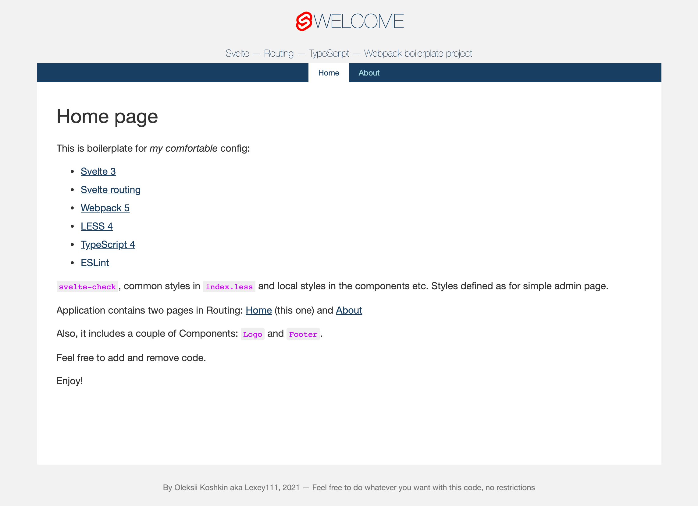

# Svelte-Routing-TypeScript-Webpack / boilerplate

## Things under the hood:

* [Svelte 3](https://svelte.dev/)
* [Svelte routing](https://github.com/EmilTholin/svelte-routing)
* [Webpack 5](https://webpack.js.org/)
* [LESS 4](http://lesscss.org/)
* [TypeScript 4](https://www.typescriptlang.org/)
* [ESLint](https://eslint.org/)
* [Docker](https://www.docker.com/)

I've tried to keep things as simple as possible.

`svelte-check`, common styles in `index.less` and local styles in the components etc. Styles defined as for simple admin page.

Application contains two pages in Routing: Home (this one) and About

Also, it includes a couple of Components: Logo and Footer.

## Installation

1. Clone the repository.
2. Run 'npm install' in the local copy (I hope you have NodeJS and NPM installed =)
3. Use one of:
   * `npm run build` for production build
   * `npm run dev` for development build (no minification)
   * `npm run watch` for development build + watch mode
   * `npm run start` for live server on `http://localhost:3030/`
   * `docker*` (see below)

## Screenshot

## Docker

To generate `dist` folder without installing NPM packages and adding local garbage, use these commands:

1. Build image: `docker build -f Dockerfile.prod -t svelte .` in the root folder.
2. Run container: `docker run --name temp svelte`
3. Copy `dist` folder from container: `docker cp temp:/app/dist ./dist`
4. Remove the container: `docker rm temp`
5. Remove the image: `docker image rm svelte`

OR

1. Run `docker_build.cmd` script.

### Docker compose

#### Production mode

In root folder run `docker-compose up` to build the files. Result will be
placed into `dist` folder.

#### Development + watch mode

In root folder run `docker-compose -f docker-compose.watch.yml up` to build the files. Result will be placed into `dist` folder and Webpack will start watching.

`node_modules` and `dist` folders will be mapped.

#### Development + online mode

In root folder run `docker-compose -f docker-compose.start.yml up` to build the files. Result will be placed into `dist` folder and application will start watching. Webserver will be available on URL `localhost:3030`.

`node_modules` and `dist` folders will be mapped.

### CLI (with local NPM install)

1. `npm i`
2. `npm run build` or `npm run build:dev`
3. `npm run build:watch` to start watching.
3. `npm run start` to run dev webserver.
